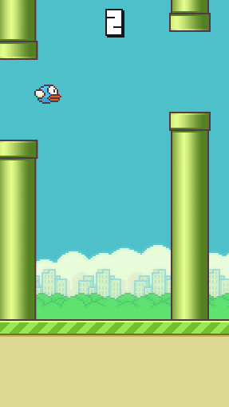
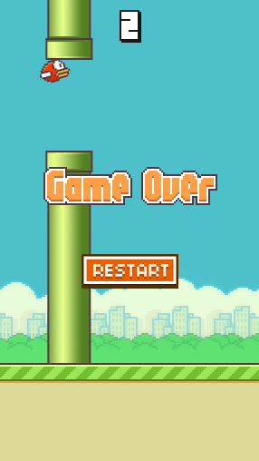

# Flappy Bird  
A Flappy Bird game in [Phaser 3](https://phaser.io/).

[Check it live!](https://igorrozani.github.io/flappy-bird)

## Table of Contents
* [Game screenshots](#game-screenshots)
* [Assets](#assets)
* [How to](#how-to)
    * [Run it](#run-it)
    * [Generate documentation](#generate-documentation)
* [Wiki](#wiki)
* [License](#license)


## Game screenshots


*Main menu*




*Playing*



*Game over*

## Assets
The assets used in this project came from the project [FlapPyBird](https://github.com/sourabhv/FlapPyBird) created by [Sourabh Verma](https://github.com/sourabhv).

## How to 

### Run it
1. Clone this repository or click Download ZIP in right panel and extract it 
```
git clone https://github.com/IgorRozani/flappy-bird.git 
```
2. Install [Http-Server](https://www.npmjs.com/package/http-server)
```
npm install http-server -g
```
3. Run the http-server from the repository's directory
```
http-server
``` 

### Generate documentation
1. Install [documentation.js](http://documentation.js.org/)
```
npm install -g documentation
```
2. Generate game.js documentation
```
documentation build js/game.js -f md > docs/game.md
```

## Wiki
We have a wiki, [check it](https://github.com/IgorRozani/flappy-bird/wiki/Wiki).

## License

[MIT License](http://opensource.org/licenses/MIT)
